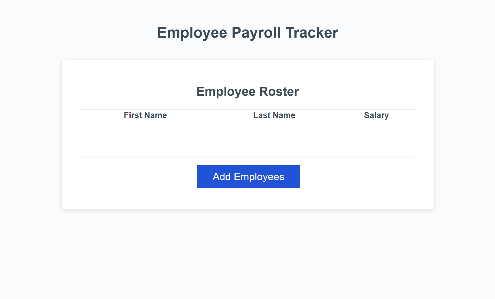

# Employee Payroll Tracker Erin Mulcahey

## Description

This application enables a payroll manager to view and manage employee payroll data by orgainzing alphabetically by last name a list of employees and their salaries. Once a list of employees is added, the user can also see the average salary of all the employees and they can see a randomly selected drawing winner.
Application URL: https://emulcahey.github.io/Employee-Payroll-Tracker-Erin-Mulcahey/

## Installation

N/A

## Usage

To use this application. click the Add Employees button. You will then be prompted to enter the first name, last name, and salary of your first employee. Once those items are added it will ask you if there is another employee to add. After all employees have been added one by one, click cancel. The application will then orgainze all the employees in the table above the button. Viewing the console, you will be able to see average salary and a randomly selected client for a drawing.

## Credits

N/A

## License

Please refer to the LICENSE in the repo.
